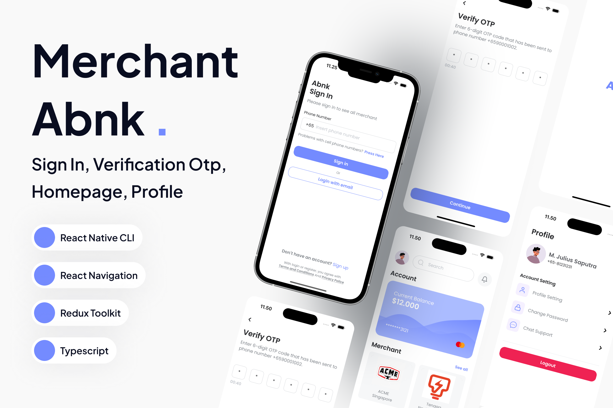

# Merchant Abnk 
[](https://codecov.io/gh/M-Julius/Merchant-Abnk)

[](screenshot/abnk.png)
Merchant Abnk is a mobile application that displays a list of merchants at abnk, with authentication by phone number, and verify by code otp.

## Currently includes:
- [Demo](https://drive.google.com/file/d/1PPFvwRib2ypZCatcYbmaPnB2K08P4d0X/view?usp=sharing)
- Built with React Native CLI
- React Navigation for routing and navigation
- Redux Toolkit for state management
- TypeScript for type safety
- Unit Testing with coverage of 88%
- And more!


## Installation

1. Clone this repository

```bash
git clone https://github.com/M-Julius/Merchant-Abnk.git
```

2. Install dependencies

```bash
cd Merchant-Abnk
yarn install
```
3. Setup environment in ```.env```
```bash
API_URL='https://api.your.com/api' # add your API_URL in here
```

4. Run a

for android
```bash
yarn android 
```
for ios
```bash
cd ios
bundle install # you need to run this only once in your project.
bundle exec pod install
cd ..
```
```bash
yarn ios
```

## Feature App:
- [x] Splashscreen
- [x] Login with mobile number
- [x] Verify OTP
- [x] Homescreen - Merchant list
- [x] Profile Screen

## Project Structure

The project is organized into several directories, each serving a specific purpose:

<pre>
app
├── core
│   ├── assets          # Contains fonts, icons, and images used in the app
│   ├── components      # Reusable UI components with corresponding tests
│   ├── model           # TypeScript type definitions
│   ├── navigation      # App navigation logic
│   ├── schema          # Schema validation (e.g., for authentication)
│   ├── services        # API services and integrations
│   ├── store           # Redux slices and store configuration
│   ├── theme           # App-wide styles and color definitions
│   └── utils           # Utility functions
└── presentation
    ├── auth            # Authentication screens and components
    ├── home            # Home screen and related components
    ├── intro           # Introductory screens (e.g., splash screen)
    └── profile         # Profile screen and components
</pre>

Each directory contains TypeScript and test files to ensure maintainable and scalable code.
